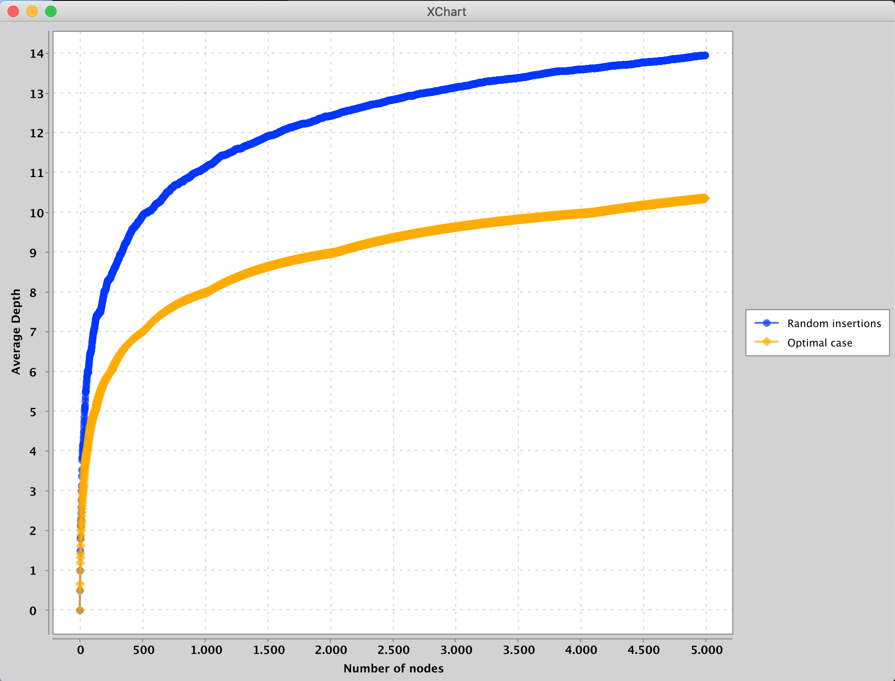
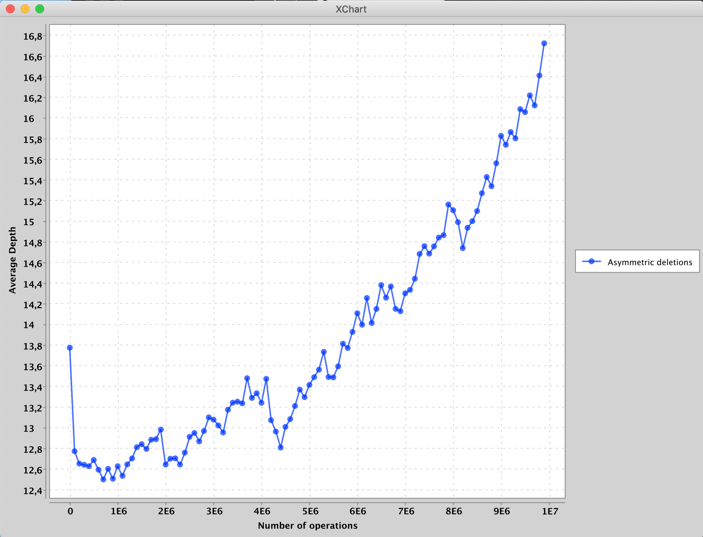
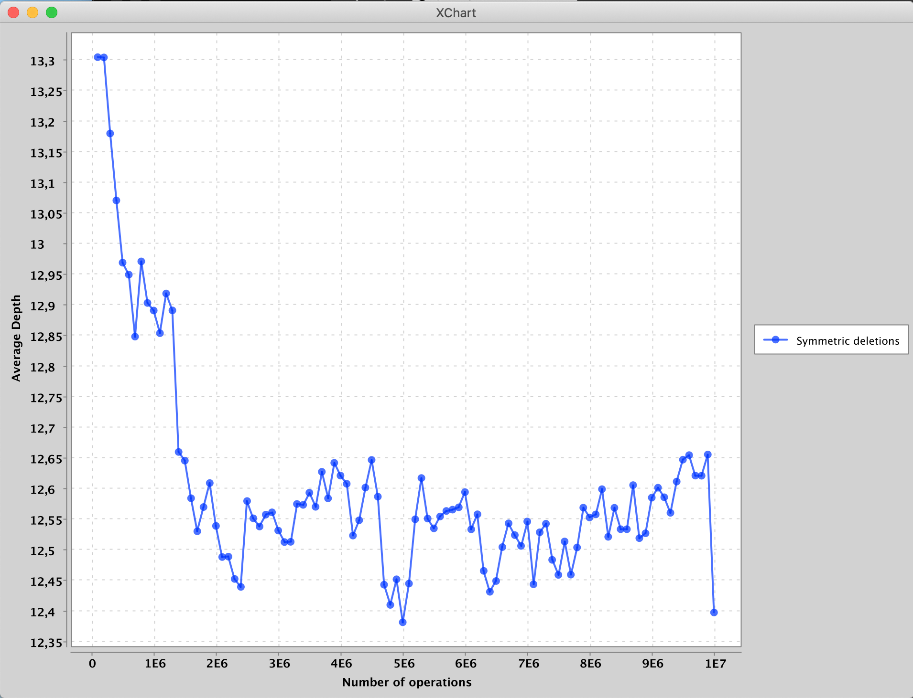

# Challenge Lab 7

Experiments on binary search trees. [src](https://sp19.datastructur.es/materials/clab/clab7/clab7)

## Experiment 1
5000 random insertions in an unbalanced BST
 show that the average depth of an unbalanced tree is around 14, while that
  in an optimal case (ie a balanced BST) would be around 10. 

## Experiment 2
From challenge lab description:
> In 1975, Gary Knott conducted an empirical study of binary search trees for his Ph.D. thesis. In pseudocode, his experiment was roughly follows:
> 
>  - Initialize a tree by randomly inserting N items. Record the average depth observed as the ‘starting depth’.
>  - Randomly delete an item using asymmetric Hibbard deletion.
>  - Randomly insert a new item.
>  - Record the average depth of the tree.
>  - Repeat steps 2-4 a total of M times.
>  - Plot the data.
>
> Here, by asymmetric Hibbard deletion, we mean the deletion process described
 in class, where deleted nodes with two children are replaced with their successor.
>
> Based on his experiments, Knott conjectured that the random deletion
> /insertion process improved the height of the tree.
>
> A later experiment by Epplinger disproved this conjecture and showed that
> random insertion/deletions using Hibbard delete actually make things worse. This study also showed that if you modify Hibbard deletion to be symmetrical by randomly switching between picking the predecessor and the successor, then Knott’s original conjecture (that the depth of the tree gets better) was actually true.

**Result**: For some number of operations, the average depth actually drops
 as we randomly insert and delete. However, as the insertion/deletion cycle
  continues, the average depth increases well above the starting
   depth.
 

## Experiment 3
Repeat experiment 2, but with symmetric deletion (i.e. randomly picking between
 successor
 and
 predecessor).
 
 **Result**: The average depth drops and stays down.
 

